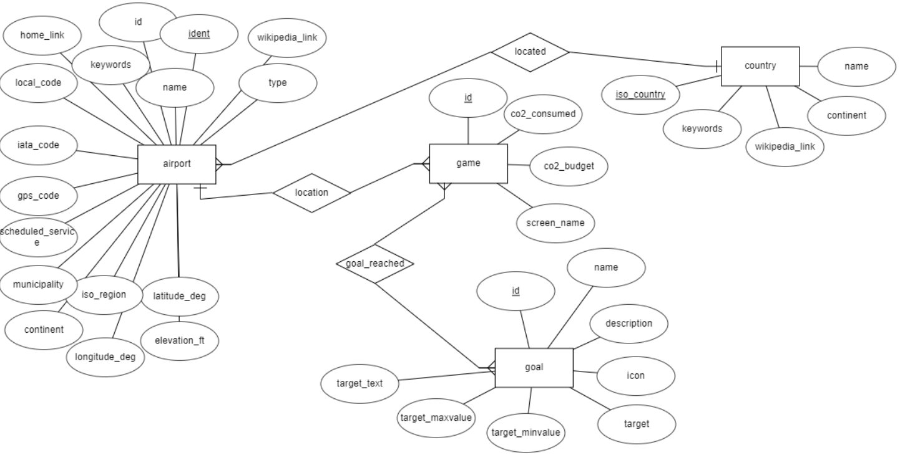

# Week 2 Exercises 8

## Question 1
Refer to the ER model below. What is the key attribute of the airport entity type?

Answer: ident

## Question 2
Refer to the ER model below. There is a one-to-many relationship between the airport and country entity types. Which of the entity types can have many relations with the other?

Answer: airport

## Question 3
Refer to the ER model below. In the diagram, there is a one-to-many relationship between the airport and country entity types. Which of the following statements describes the relationship type?

Answer: Each country can have multiple airports.

## Question 4
True or false. An entity type in the ER model corresponds to a table in the relational model.

Answer: True

## Question 5
True or false. Each relationship in the ER model corresponds to a table in the relational model.

Answer: False

## Question 6
Refer to the ER model below. In the diagram, you can see a one-to-many relationship between the airport and country entity types. If the model is converted into a relational model, which of the following statements is true:

Answer: The airport table will have a foreign key that references the country table.

## Question 7 
Refer to the ER model below. The diagram shows a one-to-many relationship between airport and game. The model is converted into a relational model. Which of the following statements is true:

Answer: The game table will have a foreign key that references the airport table.

## Question 8 
Refer to the ER model below. The diagram shows a  many-to-many relationship between game and goal.  Is the following statement about the relationship true: "A game can have many goals and several games can have the same goal."

Answer: True

## Question 9
Refer to the ER model below. The diagram shows a many-to-many relationship between game and goal. The model is converted into a relational scheme. Which of the following statements is true:

Answer: The relationship diamond will have its own table.

## Question 10 
Refer to the ER model below. The model is converted into a relational scheme, and the goal_reached relationship forms one of the tables. Which of the following statements about the foreign keys in the goal_reached table is true:

Answer: Two foreign keys: One referencing the game table and another referencing the goal table.

