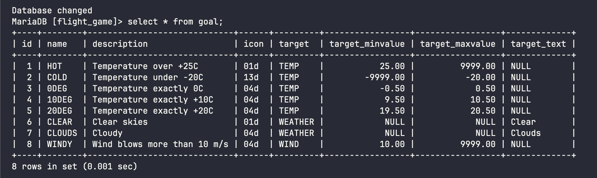
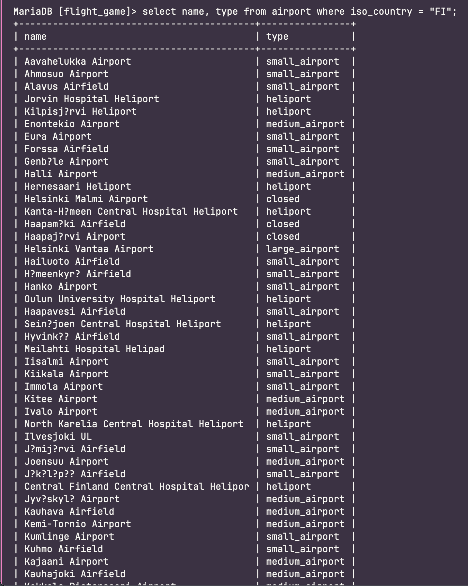
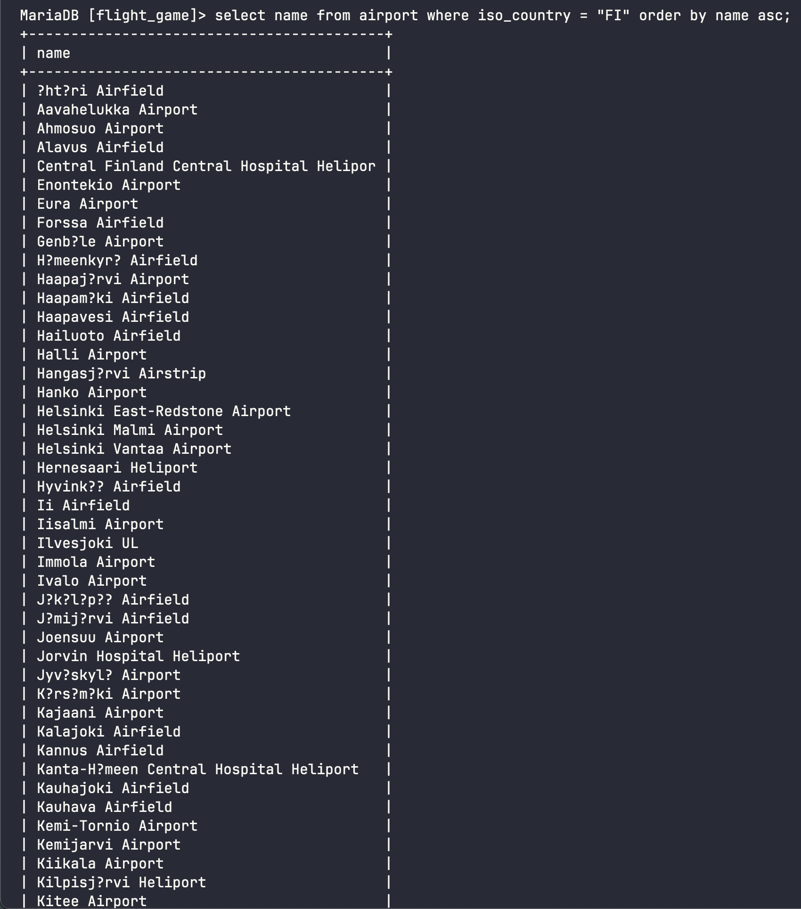

# Week 3 Exercises 2

## Question 1
```mysql
select * from goal;
```


## Question 2
```mysql
select name, type from airport where iso_country = "FI";
```


## Question 3
```mysql
select name from airport where iso_country = "FI" order by name asc;
```

