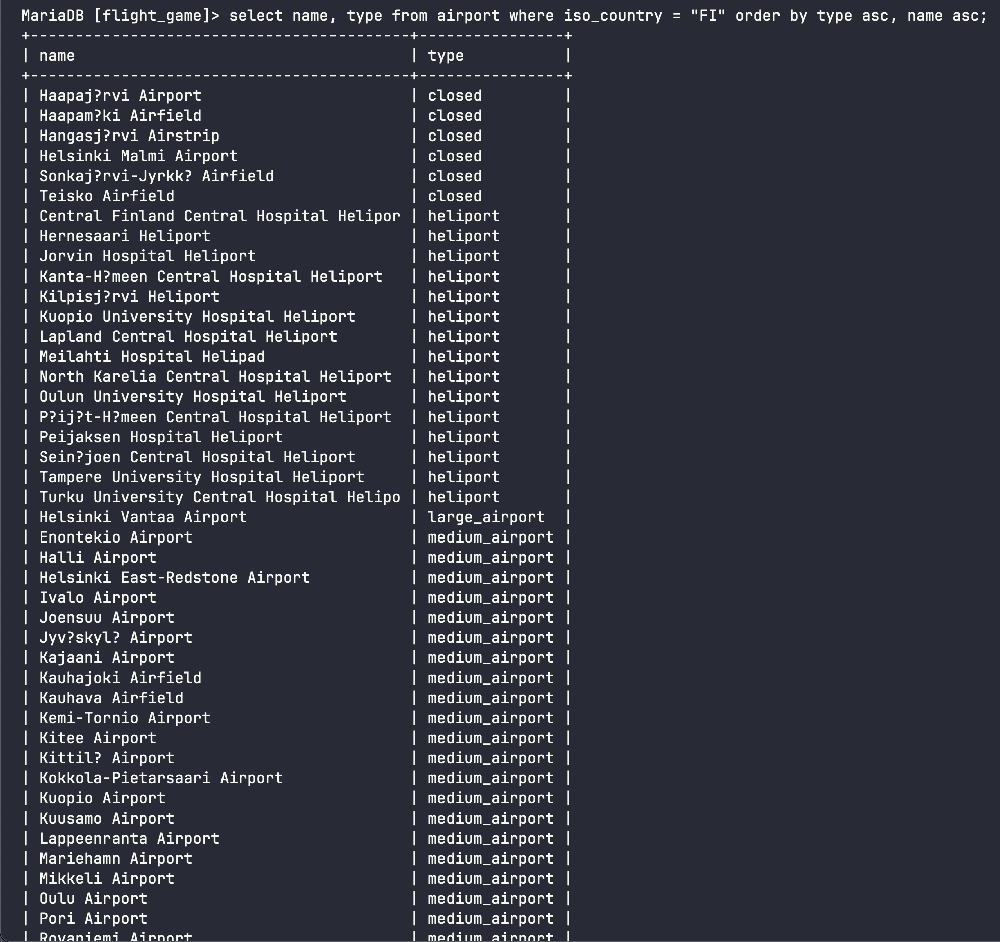
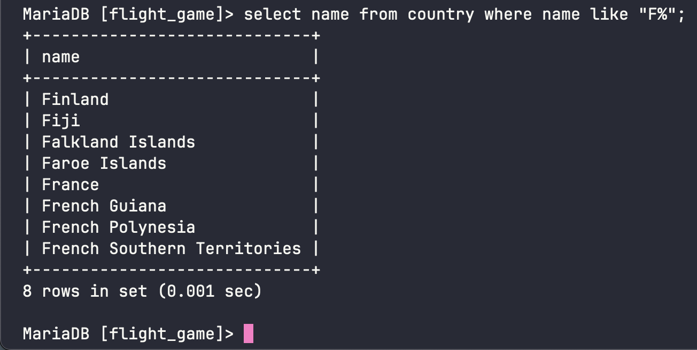
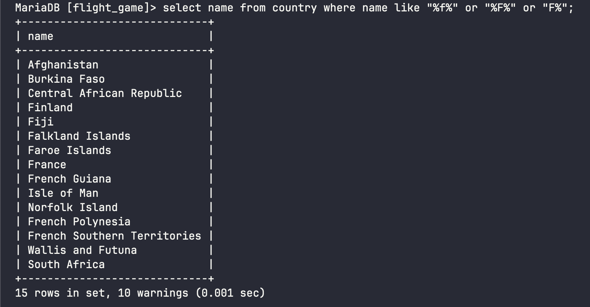
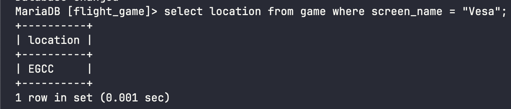
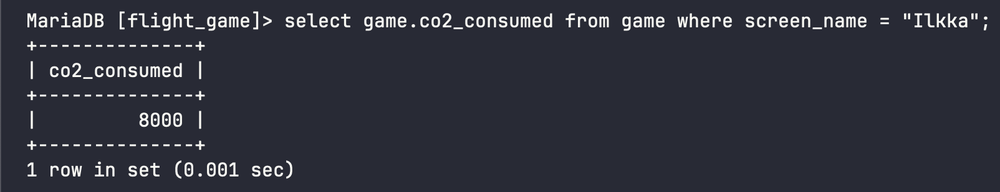
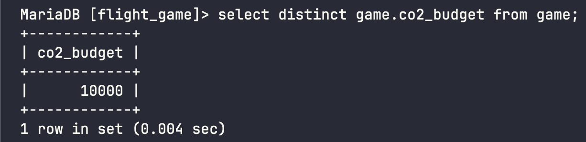
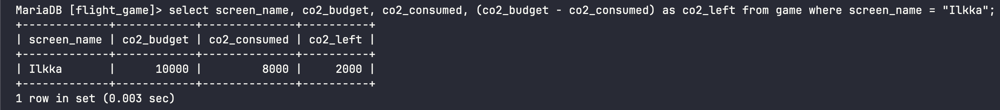

# Week 3 Exercises 2

## Question 1
```sql
select * from goal;
```


## Question 2
```sql
select name, type from airport where iso_country = "FI";
```


## Question 3
```sql
select name from airport where iso_country = "FI" order by name asc;
```


## Question 4
```sql
select name, type from airport where iso_country = "FI" order by type asc, name asc;
```


## Question 5
```sql
select name from country where name like "F%";
```


## Question 6
```sql
select name from country where name like "%f%" or "%F%" or "F%";
```


## Question 7
```sql
select location from game where screen_name = "Vesa";
```


## Question 8 
```sql
select game.co2_consumed from game where screen_name = "Ilkka";
```


## Question 9 
```sql
select distinct game.co2_budget from game;
```


## Question 10
```sql
select screen_name, co2_budget, co2_consumed, (co2_budget - co2_consumed) as co2_left 
from game 
where screen_name = "Ilkka";
```
