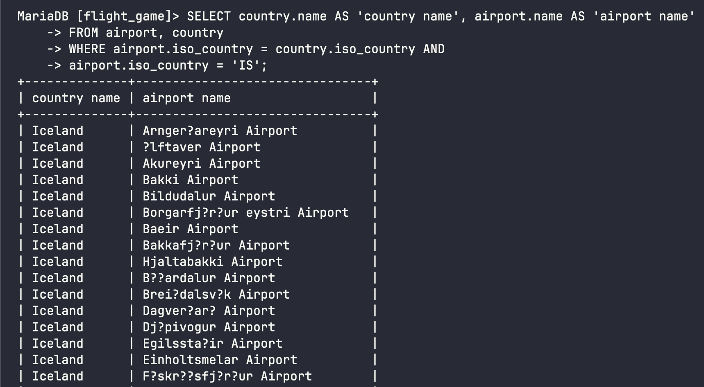
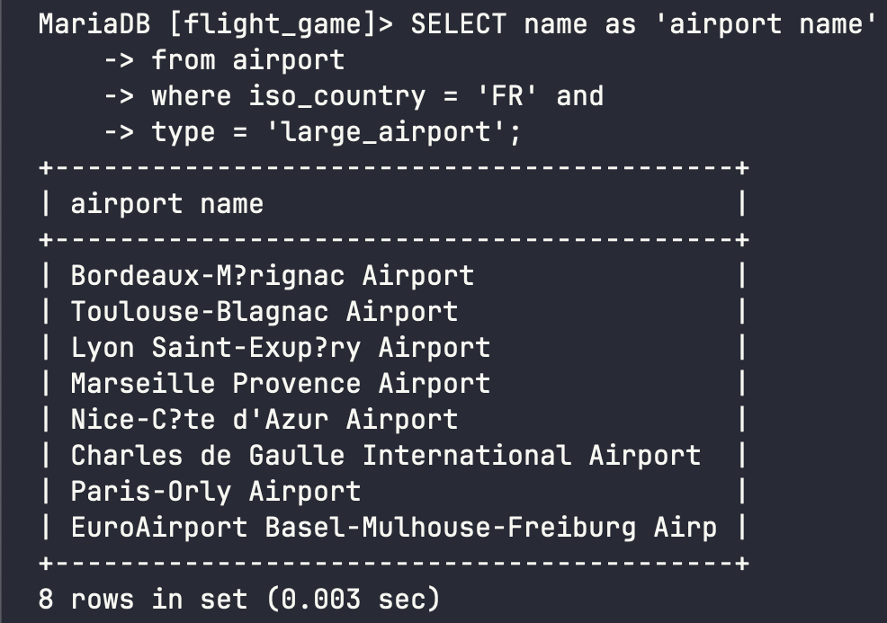
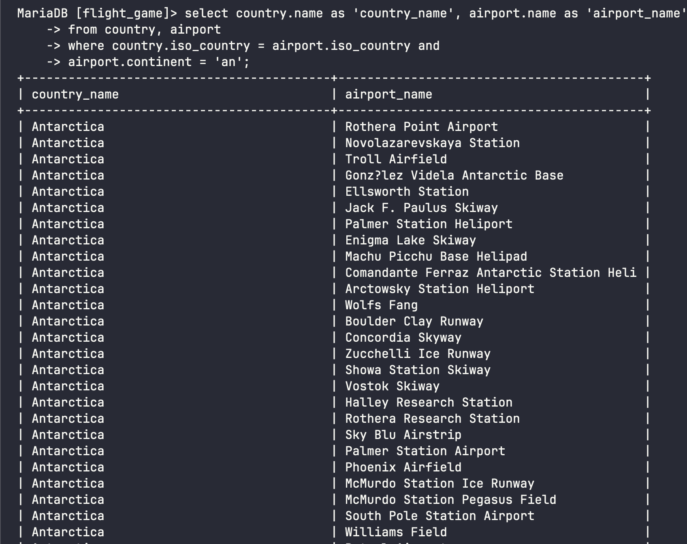
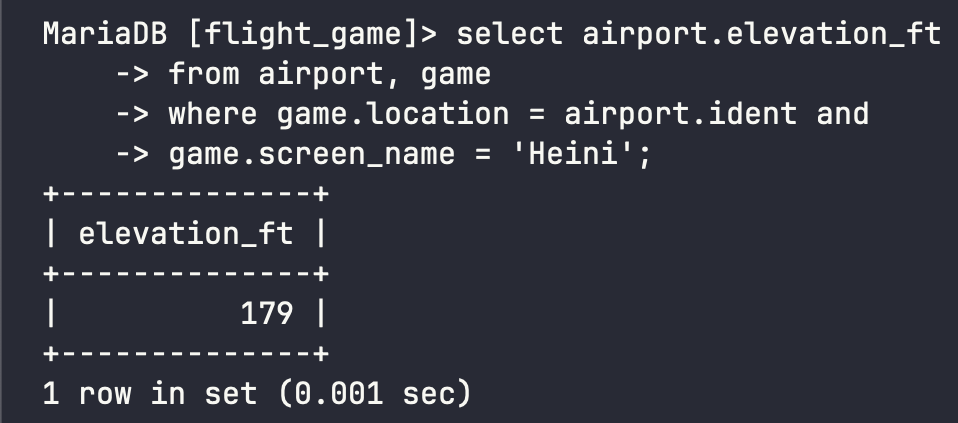
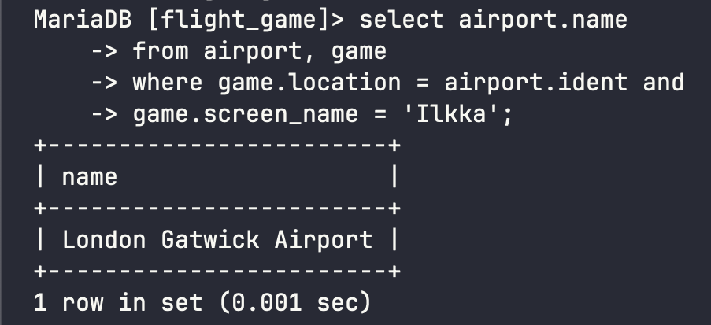
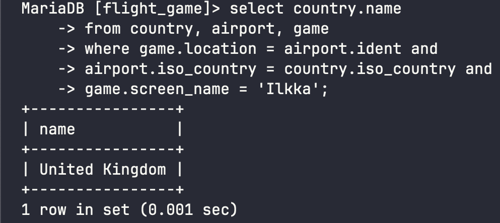
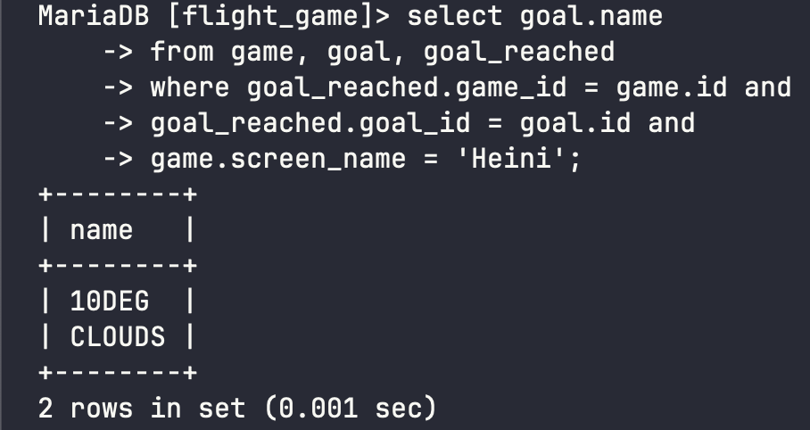
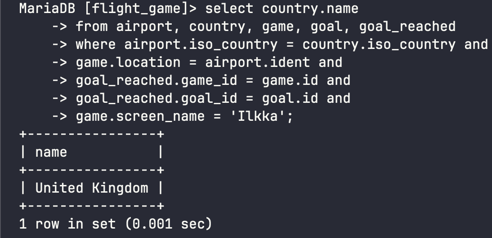

# Week 3 Exercises 3

## Question 1
```sql
select country.name as 'country name', airport.name as 'airport name'
from airport, country
where airport.iso_country = country.iso_country and
airport.iso_country = 'IS';
```


## Question 2
```sql
select name as 'airport name'
from airport
where iso_country = 'FR' and
type = 'large_airport';
```


## Question 3 
```sql
select country.name as 'country_name', airport.name as 'airport_name'
from country, airport
where country.iso_country = airport.iso_country and
airport.continent = 'an';
```


## Question 4
```sql
select airport.elevation_ft
from airport, game
where game.location = airport.ident and
game.screen_name = 'Heini';
```


## Question 5
```sql
select elevation_ft*0.3048 as 'elevation_m'
from airport, game
where game.location = airport.ident and
game.screen_name = 'Heini';
```


## Question 6
```sql
select airport.name
from airport, game
where game.location = airport.ident and 
game.screen_name = 'Ilkka';
```


## Question 7
```sql
select country.name
from country, airport, game
where game.location = airport.ident and
airport.iso_country = country.iso_country and
game.screen_name = 'Ilkka';
```


## Question 8 
```sql
select goal.name
from game, goal, goal_reached
where goal_reached.game_id = game.id and
goal_reached.goal_id = goal.id and
game.screen_name = 'Heini';
```


## Question 9 
```sql
select airport.name
from airport, game, goal, goal_reached
where game.location = airport.ident and
goal_reached.game_id = game.id and
goal_reached.goal_id = goal.id and
game.screen_name = 'Ilkka';
```


## Question 10
```sql
select country.name
from airport, country, game, goal, goal_reached
where airport.iso_country = country.iso_country and
game.location = airport.ident and
goal_reached.game_id = game.id and
goal_reached.goal_id = goal.id and
game.screen_name = 'Ilkka';
```
