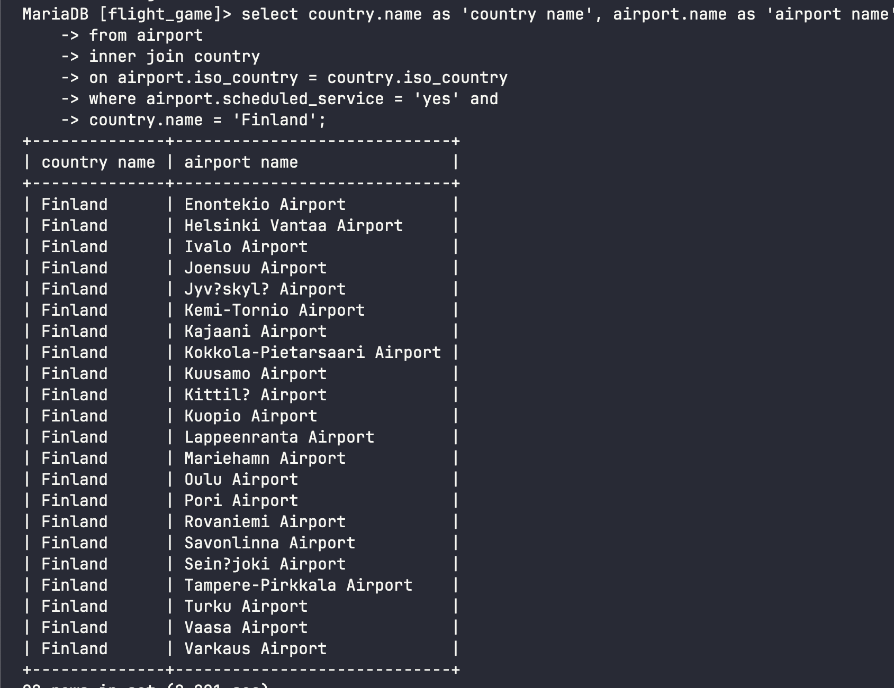
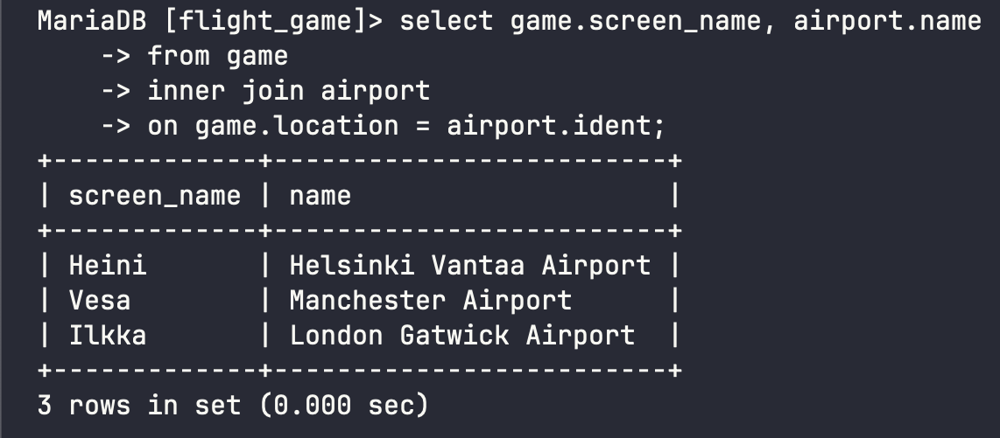
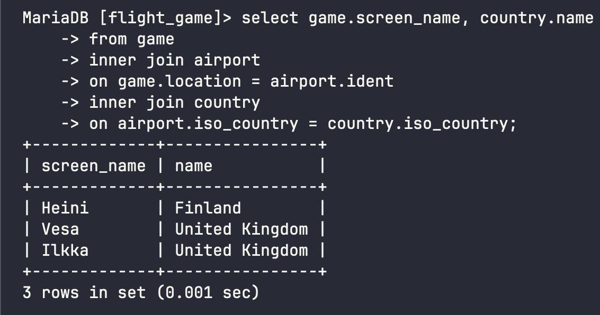
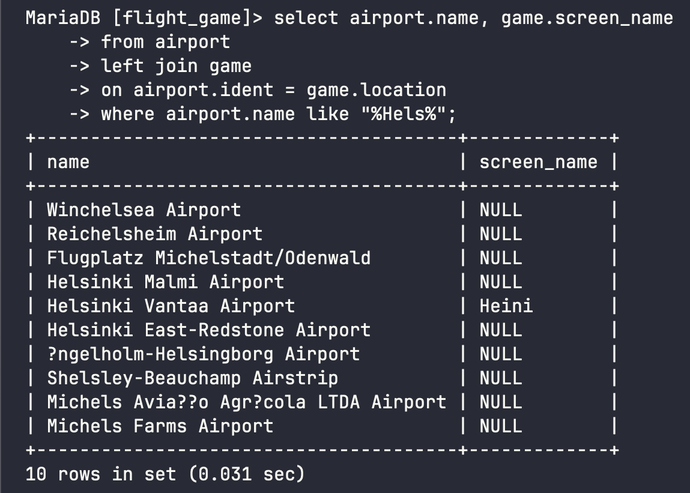

# Week 4 Exercises 4

## Question 1 
```sql
select country.name as 'country name', airport.name as 'airport name'
from airport
inner join country
on airport.iso_country = country.iso_country
where airport.scheduled_service = 'yes' and
country.name = 'Finland';
```


## Question 2 
```sql
select game.screen_name, airport.name
from game
inner join airport
on game.location = airport.ident;
```


## Question 3 
```sql
select game.screen_name, country.name
from game
inner join airport
on game.location = airport.ident
inner join country
on airport.iso_country = country.iso_country;
```


## Question 4 
```sql
select airport.name, game.screen_name
from airport
left join game
on airport.ident = game.location
where airport.name like "%Hels%";
```


## Question 5
```sql
select goal.name, game.screen_name
from goal
left join goal_reached
on goal.id = goal_reached.goal_id
left join game
on goal_reached.game_id = game.id;
```
