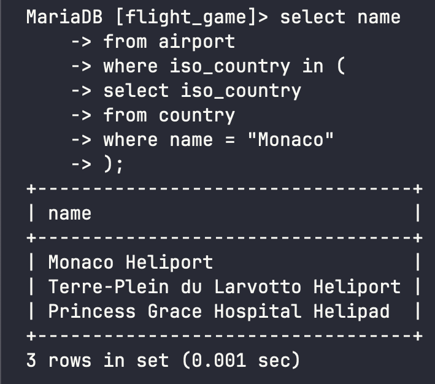
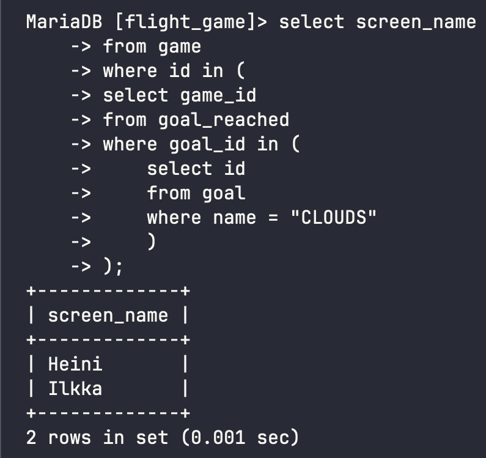
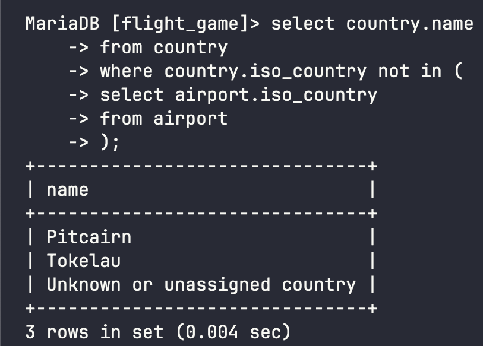
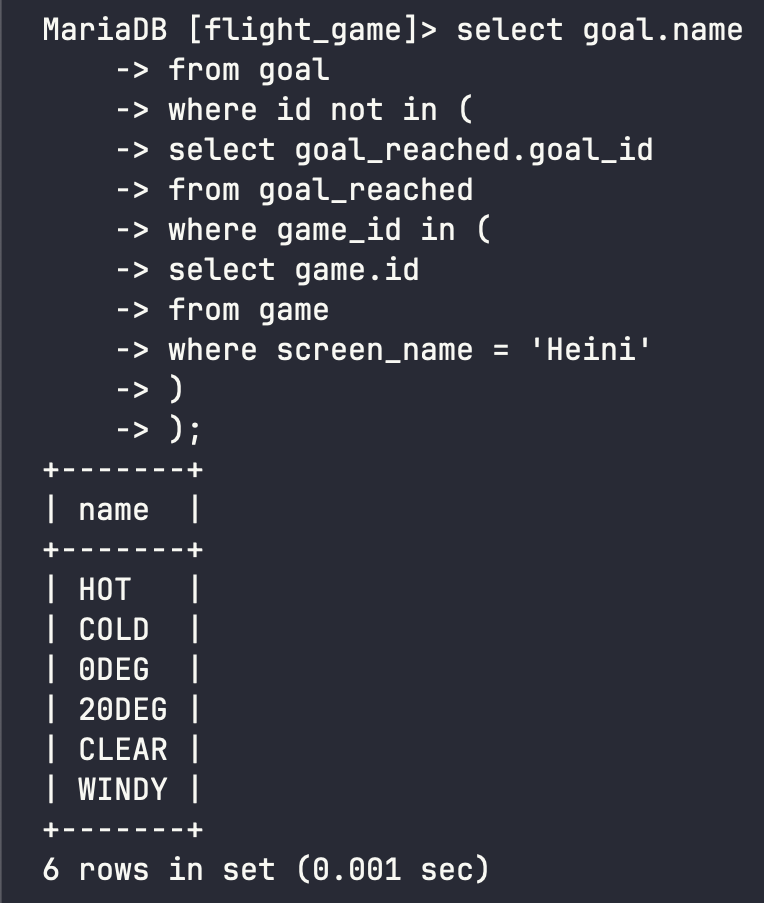

# Week 4 Exercises 5

## Question 1
```sql
select name
from country
where iso_country in (
select iso_country
from airport
where name like "Satsuma%");
``` 
;
```


## Question 3
```sql
select screen_name
from game
where id in (
select game_id
from goal_reached
where goal_id in (
    select id 
    from goal 
    where name = "CLOUDS"
    )
);
```


## Question 4
```sql
select country.name 
from country
where country.iso_country not in (
select airport.iso_country
from airport
);
```


## Question 5
```sql
select goal.name
from goal
where id not in (
select goal_reached.goal_id
from goal_reached
where game_id in (
select game.id 
from game
where screen_name = 'Heini'
)
);
```
