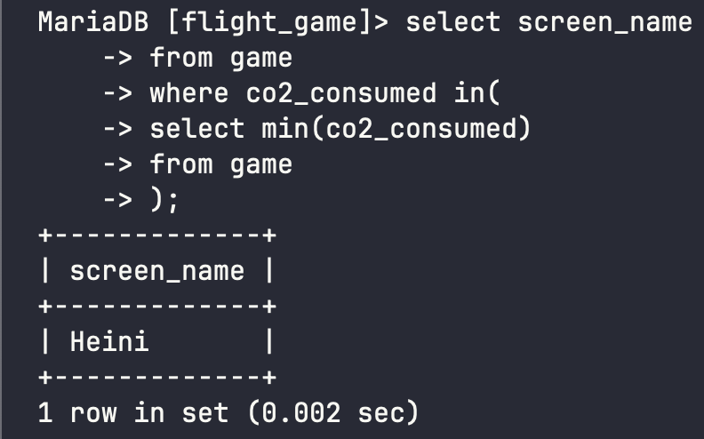

# Week 5 Exercises 6

## Question 1
```sql
select max(elevation_ft)
from airport;
```


## Question 2
```sql
select continent, count(name)
from country
group by continent;
```


## Question 3 
```sql
select screen_name, count(*)
from game, goal_reached
where id = game_id
group by screen_name;
```


## Question 4
```sql
select screen_name
from game
where co2_consumed in(
select min(co2_consumed)
from game
);
```


## Question 5 
```sql
select c.name, count(a.name)
from country c
inner join airport a
on c.iso_country = a.iso_country
group by c.name
order by count(a.name) desc
limit 50;
```


## Question 6
```sql
select country.name
from airport, country
where airport.iso_country = country.iso_country
group by country.iso_country
having count(*) > 1000;
```


## Question 7
```sql
select name
from airport
where elevation_ft in (
select max(elevation_ft)
from airport
);
```


## Question 8 
```sql
select c.name
from country c
inner join airport a
on c.iso_country = a.iso_country
where elevation_ft in (
select max(elevation_ft)
from airport
);
```


## Question 9
```sql
select count(*)
from game, goal_reached
where id = game_id and screen_name = "Vesa"
group by screen_name;
```


## Question 10 
```sql
select name
from airport
where latitude_deg in(
select min(latitude_deg)
from airport
);
```

