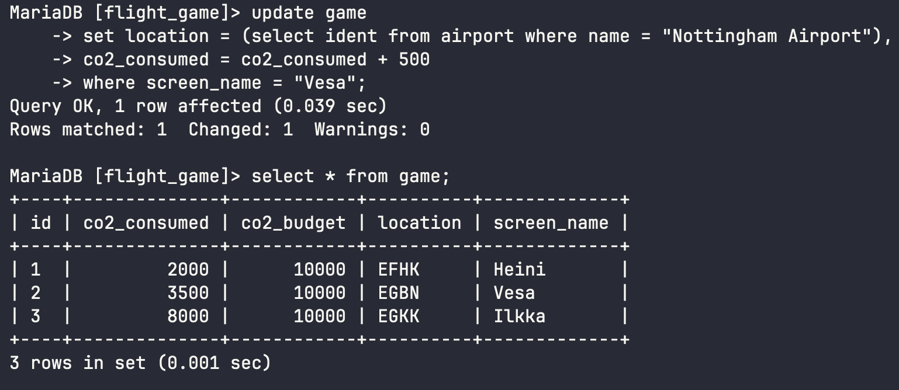
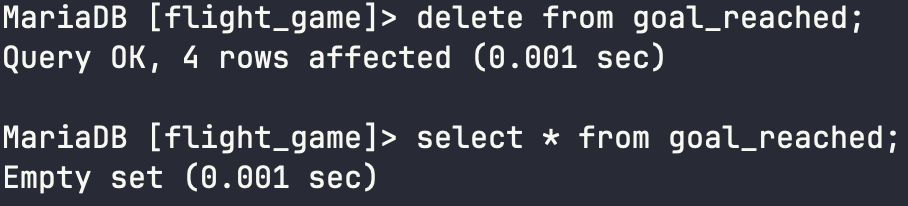
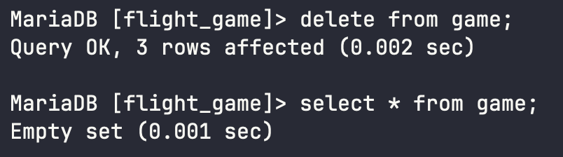

# Week 5 Exercises 7 

## Question 1 
```sql
update game 
set location = (select ident from airport where name = "Nottingham Airport"), 
co2_consumed = co2_consumed + 500
where screen_name = "Vesa";
```


## Question 2
Prepare your own database for the project by deleting all dummy data relating to the game state. To maintain referential integrity, you have to delete the data in a specific order.

Do you have to delete data first from the game table or from the goal_reached table?

Answer: goal_reached

## Question 3
```sql
delete from goal_reached;
```


## Question 4
```sql
delete from game
```
